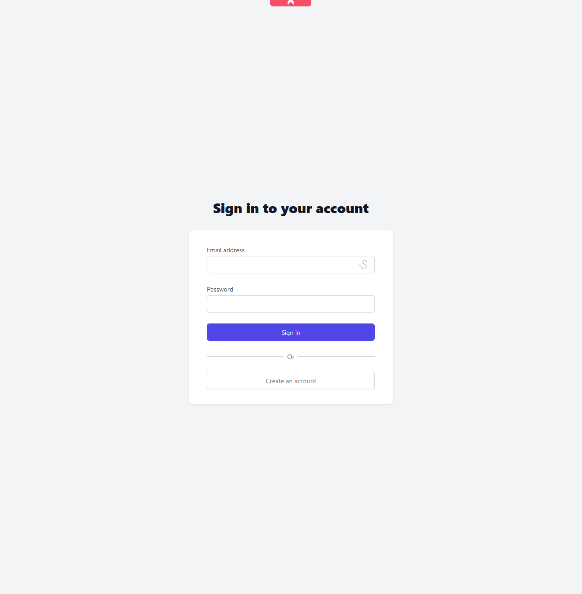
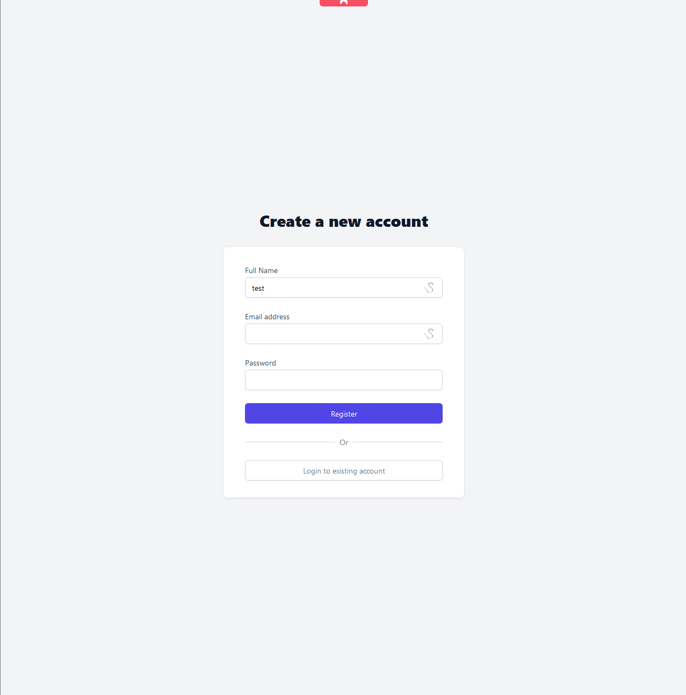
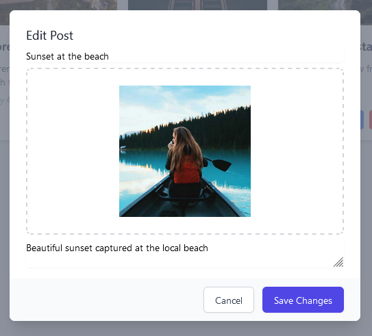
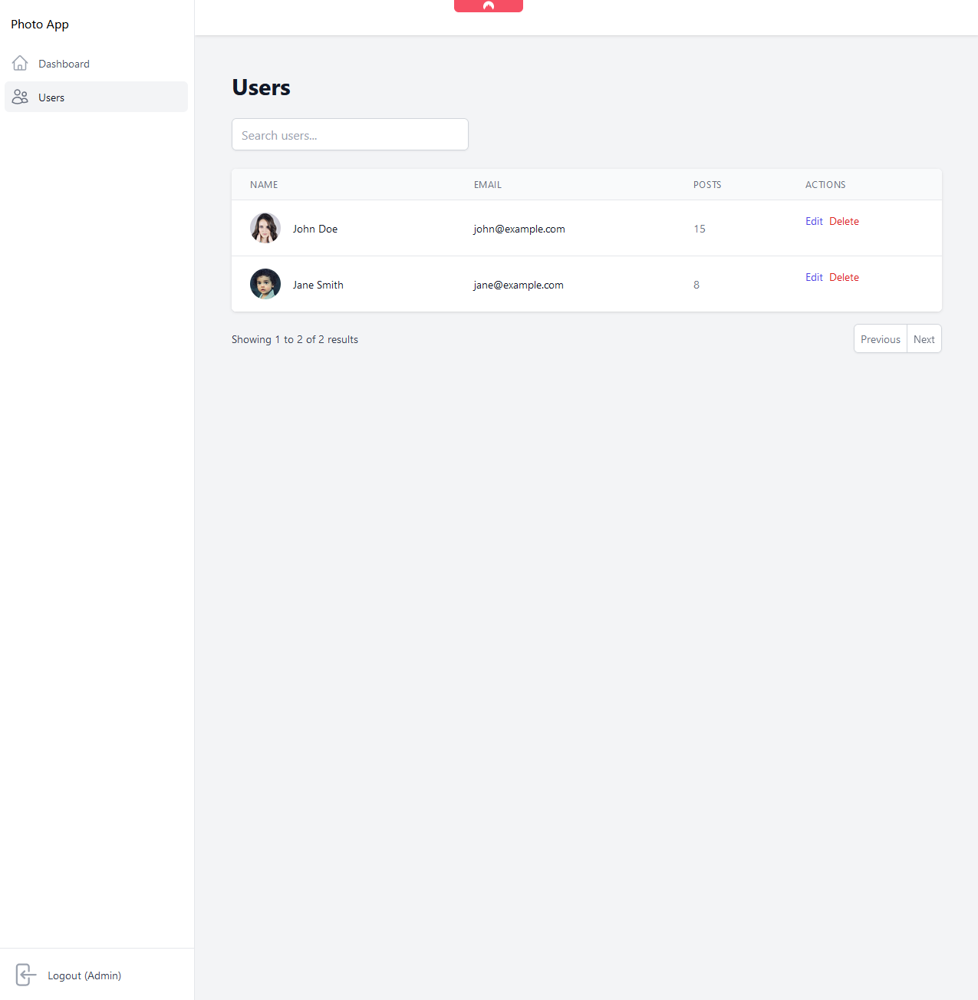
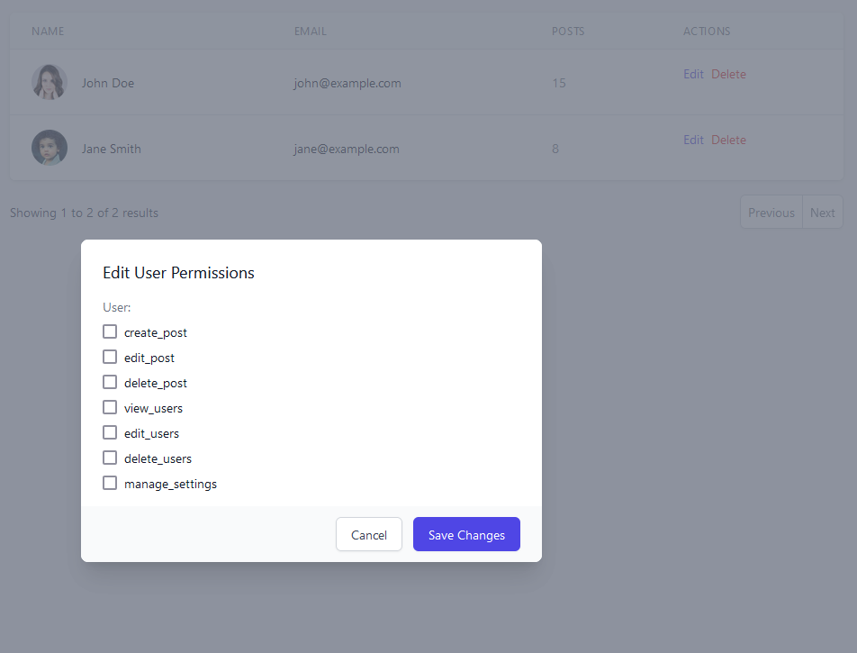

# Photo App

## Getting Started

Run the docker container compose file:

```bash
docker-compose up -d
```

The app will be available at http://localhost:8080

The backend will be available at http://localhost:5000


## Login Credentials

Default login credentials are:

- Username: admin@admin.com
- Password: 123456

## Visuals

### Login Page





### Signup Page




### Dashboard Page


### Create Post Popup


### Edit Post Popup




### Users Page




### Permissions Page





